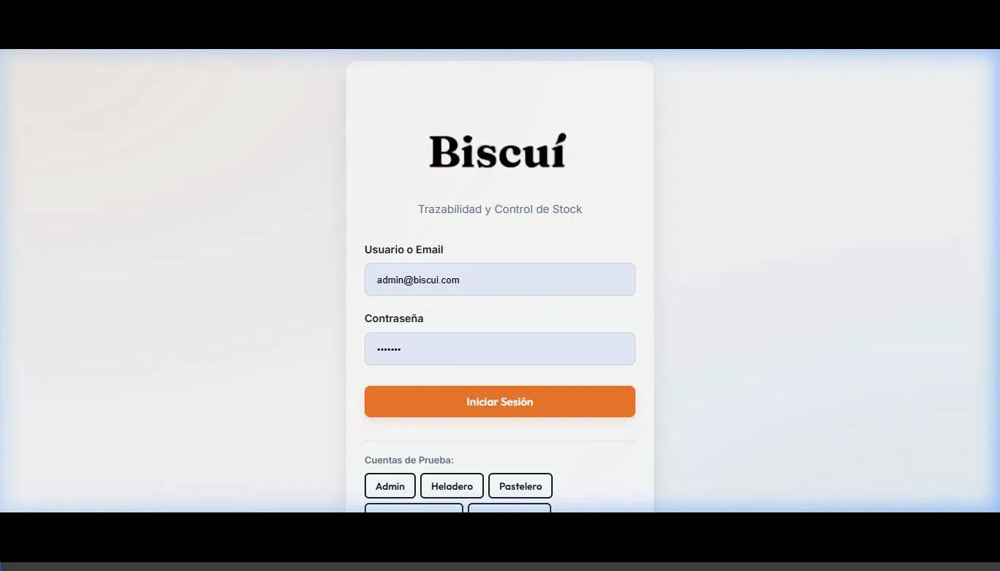
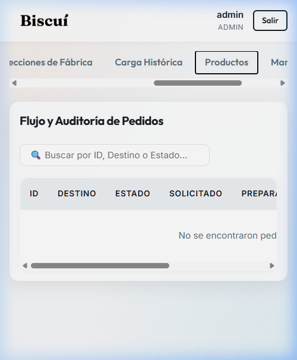
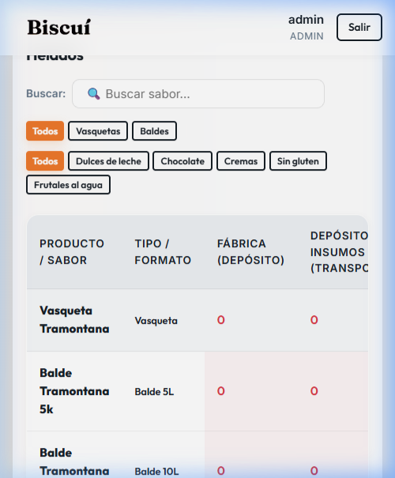

# Manual de Usuario Paso a Paso: Rol Heladero (Fábrica) - Biscui

Este manual detalla paso a paso **todas las funcionalidades** y flujos de trabajo disponibles para el usuario con rol de **Heladero** en la plataforma Biscui.

---

## 🔑 1. Acceso al Sistema

Para ingresar al sistema y acceder a tus herramientas de trabajo en fábrica:

1. Abre el navegador y dirígete a la URL de desarrollo (`http://localhost:5173/`) o a la URL del sistema publicado.
2. En la pantalla de inicio de sesión:
   * **Email / Usuario:** Escribe `heladero@biscui.com`
   * **Contraseña:** Escribe `heladero123`
3. Presiona el botón **Iniciar Sesión**.

---

## 🍨 2. Funcionalidad A: Cargar Producción (Pestaña Principal)

Esta sección permite registrar los lotes de helado fabricados diariamente, calculando los pesos netos en base a la balanza física de fábrica.

### Paso 1: Abrir el Formulario de Registro
Al ingresar, estarás en la pestaña **Cargar Producción**. En la parte izquierda de la pantalla verás el formulario de **Registro de Fabricación**.

### Paso 2: Seleccionar el Sabor/Producto
1. Haz clic en el campo **Seleccionar Producto / Sabor**.
2. Escribe el nombre del sabor que fabricaste (ej. *"Dulce de Leche"* o *"Frutilla"*). El sistema filtrará automáticamente mostrando únicamente los productos de la categoría **Helados**.
3. Selecciona el sabor correcto de la lista. El formulario cambiará mostrando el producto y su tipo de envase.
   * *Si necesitas corregir la selección, presiona el botón rojo **Cambiar**.*

### Paso 3: Configurar Fecha y Destino
1. Elige la **Fecha de Fabricación** en el calendario (por defecto se selecciona el día actual).
2. **Destinar a Stock de Eventos (Opcional):**
   * Si el producto fabricado corresponde a **Baldes** y su destino es para eventos especiales (y no la venta común de sucursales), activa la casilla **Destinar a Stock de Eventos**.
   * *Nota: Las Vasquetas no permiten esta opción, por lo que el casillero no se mostrará si seleccionas una Vasqueta.*

### Paso 4: Cargar las Unidades Producidas
1. En el campo **Cantidad Fabricada**, ingresa el número total de recipientes llenados (ej. `3`).
2. El sistema habilitará una lista con campos individuales denominados **# 1 (Peso Bruto)**, **# 2 (Peso Bruto)**, etc.

### Paso 5: Registro de Balanza y Descuento de Tara (Paso Clave)
> [!IMPORTANT]
> **Taras de envases pre-cargadas en el sistema:**
> * **Vasqueta:** `0.620 kg` de tara.
> * **Balde 5L:** `0.155 kg` de tara.
> * **Balde 10L:** `0.270 kg` de tara.

1. Pesa cada recipiente lleno en la balanza física.
2. Escribe el **Peso Bruto** (en kg) obtenido en el campo correspondiente a cada recipiente (ej: para el primer balde, escribe `4.155`).
3. El sistema restará de forma automática el peso de la tara del envase y mostrará abajo el **Total Bruto** y el **Total Neto** de kilos de helado listos para registrar.

### Paso 6: Confirmar y Generar Lote
1. Revisa que todos los pesos sean correctos.
2. Presiona el botón azul **Registrar Entrada y Auto-Lote**.
3. El sistema creará un código de lote único (ej: `LOT-20260608-XXXX`) y sumará los kilos netos al inventario de Fábrica.

### Paso 7: Consultar Historial Reciente de Lotes
En el panel derecho de la misma pestaña verás la tabla **Producción Reciente (Lotes)**. Allí podrás:
* Verificar los códigos de lote generados.
* Ver los pesos individuales cargados y el neto total en kilos.
* Confirmar la cantidad de envases y la fecha de producción.

---

## 📦 3. Funcionalidad B: Mi Stock Fábrica (Pestaña Stock)

Esta herramienta permite consultar en tiempo real el inventario acumulado en el depósito de Fábrica y filtrar sabores rápidamente.

### Paso 1: Cambiar de Pestaña
Haz clic en el botón **Mi Stock Fábrica** en el menú de pestañas superior.

### Paso 2: Alternar entre Stock Común y Eventos
En la esquina superior derecha verás dos botones selectores:
* **📦 Stock Común:** Muestra el stock disponible para enviar a los locales comerciales habituales.
* **🎉 Stock de Eventos:** Muestra el stock apartado exclusivamente para consumos en ferias o eventos.
*Haz clic en el botón correspondiente para ver la lista de inventario deseada.*

### Paso 3: Filtrar y Buscar Sabores
Puedes acotar la lista de sabores mediante tres herramientas combinables:
1. **Buscador de Texto:** Escribe el nombre de un sabor en la barra de búsqueda *"Buscar por nombre..."*.
2. **Filtro de Formato:** Selecciona `Todos`, `Vasquetas` o `Baldes` para ver solo envases específicos.
3. **Filtro de Familia/Categoría:** Selecciona botones rápidos como `Dulces de leche`, `Chocolate`, `Cremas`, `Sin gluten` o `Frutales al agua`.

### Paso 4: Leer la Grilla de Stock
La grilla muestra la información estructurada de la siguiente manera:
* **Sabor / Helado:** Nombre del sabor y su categoría.
* **Vasqueta:** Cantidad física de vasquetas disponibles.
* **Balde 5L:** Cantidad física de baldes de 5 litros.
* **Balde 10L:** Cantidad física de baldes de 10 litros.
* **Kilos Netos Totales:** El peso neto total calculado en base a la cantidad de recipientes y su peso neto estándar (resaltado en **Verde** si es mayor a 0).

---

## 🎉 4. Funcionalidad C: Pedidos de Eventos (Pestaña Eventos)

Esta función te permite preparar y despachar los pedidos que se solicitan exclusivamente desde el stock apartado para eventos.

### Paso 1: Ver Pedidos Solicitados
Haz clic en la pestaña **Pedidos de Eventos**. Verás la grilla de **Pedidos de Eventos por Preparar**.
* *Si la lista es muy larga, puedes buscar por número de Pedido o Nombre del Destino en la barra de búsqueda superior.*

> [!NOTE]
> **Origen de los Pedidos de Eventos:** Estos pedidos de fabricación pueden ser creados y solicitados directamente por el **Administrador** desde el panel general activando la opción *"Solicitar Fabricación al Heladero"*, lo que te enviará el pedido en estado `Solicitado` para que lo prepares.

### Paso 2: Revisar el Pedido
1. Ubica el pedido en estado `Solicitado`.
2. Presiona el botón **Revisar y Preparar**.
3. Se abrirá una ventana flotante (modal) con los detalles del pedido, listando los sabores y las cantidades exactas solicitadas para el evento.

### Paso 3: Confirmar la Preparación
1. Realiza el control físico en la cámara frigorífica de fábrica y aparta los baldes solicitados.
2. **Selecciona el Origen del Stock (Paso Clave):**
   * En la ventana flotante verás el selector **Seleccionar Origen del Stock para Descontar**.
   * **🎉 Stock de Eventos (Predeterminado):** Descuenta las cantidades del inventario específico apartado para eventos.
   * **📦 Stock Común / Regular (Sucursales):** Si no posees stock en la sección de eventos pero tienes el producto disponible en la sección común (por ejemplo, si se fabricó sin marcar la casilla de eventos por error o es un producto genérico), selecciona esta opción. El sistema buscará y descontará los baldes del stock común.
3. Presiona el botón verde **Confirmar Preparación de Pedido**.
4. **¿Qué sucede al confirmar?**
   * El sistema descuenta de forma automática las cantidades del origen de stock seleccionado en Fábrica.
   * El pedido cambia de estado a `Preparado`.
   * Queda guardado y listo para que el transportista lo retire y realice la entrega.
5. Presiona **Cerrar** para volver a la lista de pedidos.

---

## 📱 5. Operación en Pantallas Móviles

Todas tus pestañas de trabajo están optimizadas para ser utilizadas cómodamente desde un teléfono celular o tableta en la fábrica:
* Las pestañas superiores (`Cargar Producción`, `Mi Stock Fábrica`, `Pedidos de Eventos`) se pueden desplazar horizontalmente deslizando el dedo si la pantalla es pequeña.
* Las tablas de stock e historiales tienen deslizamiento lateral encapsulado para que puedas leer todas las columnas sin romper el diseño visual.
* La interfaz utiliza el tema claro premium de Biscui, garantizando una alta legibilidad incluso bajo la iluminación de la planta de producción.

